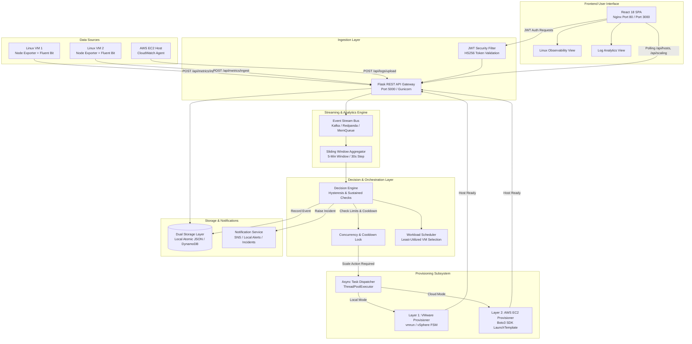
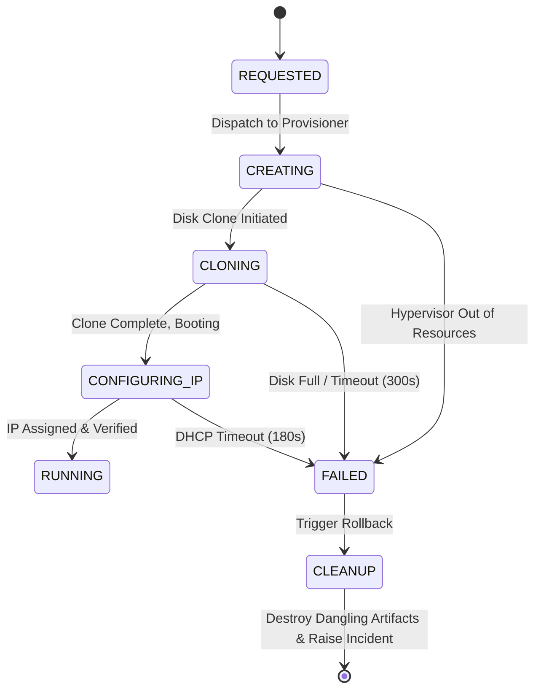

# Real-Time Linux Observability, Log Analytics & Auto-Scaling Platform - Project Description and Edge Cases

## 1. Project Overview & Architectural Evolution

The **Real-Time Linux Observability, Log Analytics & Auto-Scaling Platform** (formerly *AWS Cloud Log Analyzer*) is an enterprise-grade, distributed observability and autonomous infrastructure management solution. It bridges the gap between passive log ingestion and closed-loop infrastructure orchestration.

The platform continuously observes Linux virtual machines, streams high-frequency hardware metrics and application logs through a real-time event bus (Apache Kafka / Redpanda with an in-memory fallback), aggregates system telemetry over 5-minute sliding windows, evaluates workload demand using an intelligent auto-scaling decision engine, and dynamically orchestrates virtual machine instances across two distinct layers:
1. **Layer 1 (Local Development / On-Premise)**: VMware Workstation / vSphere REST API with a multi-state finite state machine (FSM).
2. **Layer 2 (Cloud Production)**: AWS EC2 via Boto3 with launch templates, IAM roles, and VPC auto-provisioning.

Simultaneously, the platform maintains 100% backward compatibility with all legacy log analysis capabilities: JWT authentication, severity classification (INFO, WARNING, ERROR, CRITICAL), dual storage modes (Atomic JSON Local Storage vs. AWS DynamoDB), CloudWatch log forwarding, and AWS SNS alerting.

```
+----------------------------------------------------------------------------------------------------+
|                      REAL-TIME LINUX OBSERVABILITY & AUTO-SCALING PLATFORM                        |
+----------------------------------------------------------------------------------------------------+
|                                                                                                    |
|   +--------------------+     +---------------------+     +-------------------------------------+   |
|   |   Linux VMs /      |     |  Prometheus Node    |     |          Fluent Bit Agent           |   |
|   |   Bare-Metal Hosts | --> |  Exporter (Port 9100| --> |  /var/log/syslog & Application Logs |   |
|   +--------------------+     +---------------------+     +-------------------------------------+   |
|              |                          |                                   |                      |
|              v                          v                                   v                      |
|   +--------------------------------------------------------------------------------------------+   |
|   |                    REST Telemetry Ingestion & Stream Producers                             |   |
|   |         POST /api/hosts/register | POST /api/metrics/ingest | POST /api/logs/upload         |   |
|   +--------------------------------------------------------------------------------------------+   |
|                                                |                                                   |
|                                                v                                                   |
|   +--------------------------------------------------------------------------------------------+   |
|   |              Kafka / Redpanda Real-Time Event Bus (Topic: host-metrics-raw)                |   |
|   |                   (Buffer Fallback: Thread-Safe Ring Queue in Memory)                      |   |
|   +--------------------------------------------------------------------------------------------+   |
|                                                |                                                   |
|                                                v                                                   |
|   +--------------------------------------------------------------------------------------------+   |
|   |              Sliding Window Stream Processor (5-Minute Window, 30s Slide)                  |   |
|   |       Calculates: Sustained CPU, Memory, Disk IOPS, Network P95, Anomaly Scores           |   |
|   +--------------------------------------------------------------------------------------------+   |
|                                                |                                                   |
|                                                v                                                   |
|   +--------------------------------------------------------------------------------------------+   |
|   |                Autonomous Decision Engine & Hysteresis Controller                          |   |
|   |    Rule Evaluation | Cooldown Enforcement | Max/Min VM Guardrails | Distributed Locks      |   |
|   +--------------------------------------------------------------------------------------------+   |
|            |                                                                     |                 |
|            | SCALE_OUT / SCALE_IN Trigger                                        | Job Routing     |
|            v                                                                     v                 |
|   +----------------------------------+                         +-------------------------------+   |
|   |   Async Provisioning Worker      |                         |   Least-Utilized Workload     |   |
|   |   Thread Pool (FSM Executor)     |                         |   Scheduler (Routing Engine)  |   |
|   +----------------------------------+                         +-------------------------------+   |
|            |                         |                                                             |
|            | Layer 1                 | Layer 2                                                     |
|            v                         v                                                             |
|   +--------------------+    +--------------------+                                                 |
|   | VMware Workstation |    |   AWS EC2 Boto3    |                                                 |
|   | vSphere REST API   |    | Launch Template    |                                                 |
|   +--------------------+    +--------------------+                                                 |
|                                                                                                    |
+----------------------------------------------------------------------------------------------------+
```

---

## 2. Core Capabilities Inventory

### 2.1 Linux Host & Metric Observability
- **Host Inventory Tracking**: Real-time registry of all monitored virtual machines and physical nodes, tracking hostname, IP address, CPU cores, RAM capacity, operating system, hypervisor type, lifecycle state (`PENDING`, `RUNNING`, `DRAINING`, `STOPPED`, `TERMINATED`), and health status (`HEALTHY`, `DEGRADED`, `OFFLINE`).
- **Heartbeat & Watchdog Sentinel**: Continuous tracking of host check-ins. If a host fails to report within 90 seconds, the watchdog flags the node as `DEGRADED`; if silent for >180 seconds, it transitions to `OFFLINE`, triggers an incident record, and removes the host from the workload scheduling pool.
- **Node Exporter Collector**: High-resolution metrics collector scraping Prometheus Node Exporter endpoints (`/metrics`) parsing `node_cpu_seconds_total`, `node_memory_MemAvailable_bytes`, `node_filesystem_free_bytes`, `node_network_receive_bytes_total`, and `node_load1`.
- **Fluent Bit Parsing**: Structured log streaming capturing syslog, auth.log, dmesg, and application logs with regex-based timestamp normalization and log-level extraction.

### 2.2 Streaming & Sliding Window Analytics
- **Dual-Mode Event Bus**: Publishes telemetry events to an Apache Kafka / Redpanda cluster topic (`host-metrics-raw`). If external Kafka brokers are offline, it seamlessly falls back to a thread-safe in-memory ring buffer with replay capability.
- **5-Minute Sliding Window Stream Processor**: Eliminates false positives by calculating rolling statistical aggregates (mean, standard deviation, P95) across a 5-minute sliding window (updated every 30 seconds), preventing transient spikes from triggering catastrophic provisioning cascades.

### 2.3 Closed-Loop Auto-Scaling & Scheduling
- **Intelligent Decision Engine**: Evaluates cluster state against configurable thresholds (default: CPU > 80% or Memory > 85% for scale-out; CPU < 25% and Memory < 30% for scale-in).
- **Hysteresis & Flapping Mitigation**: Enforces a 300-second cooldown period between scaling actions to allow freshly booted VMs to stabilize before further evaluations occur.
- **Distributed Concurrency Lock**: Thread-safe locking prevents duplicate simultaneous provisioning tasks.
- **Capacity Guardrails**: Strict enforcement of `min_vms` (default: 2) and `max_vms` (default: 8) boundaries.
- **Dry-Run Audit Mode**: Evaluates rules and emits audit events without modifying virtual infrastructure.
- **Least-Utilized Workload Scheduler**: Automatically dispatches compute jobs to the healthiest VM with the lowest composite resource load score:
  $$\text{Score} = (\text{CPU}\% \times 0.5) + (\text{Memory}\% \times 0.3) + (\text{Disk}\% \times 0.2)$$

### 2.4 Hybrid Dual-Tier Provisioning Engine
- **Layer 1: VMware Workstation / vSphere Engine**:
  - Direct local VM automation via `vmrun` or vSphere REST API.
  - Full Finite State Machine (FSM): `REQUESTED` $\rightarrow$ `CREATING` $\rightarrow$ `CLONING` $\rightarrow$ `CONFIGURING_IP` $\rightarrow$ `RUNNING` (with rollback to `FAILED` on exception).
  - Linked cloning from verified golden templates (`ubuntu-22.04-template.vmx`).
- **Layer 2: AWS EC2 Cloud Engine**:
  - Direct cloud scale-out using AWS Boto3 SDK.
  - Provisions EC2 instances (`t3.medium` / `t3.large`) into configured Subnets, Security Groups, and Launch Templates.
  - Automatically tags instances with `Project=LinuxObservabilityAutoScaling` and injects `cloud-init` bootstrap scripts (`vm_template_init.sh`).

### 2.5 Unified Dual-Storage & Legacy Log Analytics
- **Dual-Storage Provider**: Seamless switching via `STORAGE_MODE` (`local` vs. `aws`).
  - *Local Mode*: Atomic JSON storage with thread-safe `.tmp` writes for hosts, metrics, alerts, scaling events, incidents, and provisioning tasks.
  - *AWS Mode*: High-throughput DynamoDB tables (`CloudLogs`, `CloudAlerts`, `CloudStats`, `Hosts`, `ResourceMetrics`, `ScalingEvents`).
- **Legacy Ingestion & Alerting**: File upload modal, severity analyzer (CRITICAL, ERROR, WARNING, INFO), CSV export, CloudWatch log streams, and AWS SNS notifications.

---

## 3. High-Level Architecture & Component Interaction



---

## 4. Main Application Flows

### 4.1 Telemetry Ingestion and Real-Time Stream Flow
```
[Node Exporter / Fluent Bit]
           │
           ▼
[POST /api/metrics/ingest]
           │
           ▼ (Validates schema & host registration)
[EventStream.publish_metric()]
           │
           ├─► [Kafka / Redpanda Topic: host-metrics-raw] (Primary)
           └─► [In-Memory Ring Queue] (Fallback if broker unreachable)
           │
           ▼
[SlidingWindowProcessor.add_metric()]
           │
           ▼ (Maintains 5-minute time window per host)
[SlidingWindowProcessor.get_window_stats(host_id)]
           │
           ▼
[Returns: sustained_cpu, sustained_memory, iops, error_rate]
```

### 4.2 Auto-Scaling Decision and Provisioning Lifecycle Flow
```
[DecisionEngine.evaluate_cluster()]
           │
           ▼
[Check Cluster Average Sustained Utilization]
           │
           ├─► CPU > 80% OR Memory > 85%?
           │         │
           │         ▼
           │   [Check Cooldown Timer (300s since last action)]
           │         │ (Passed)
           │         ▼
           │   [Check Current Running VMs < max_vms (8)]
           │         │ (Passed)
           │         ▼
           │   [Acquire Scaling Concurrency Mutex]
           │         │
           │         ▼
           │   [Trigger SCALE_OUT Action]
           │         │
           │         ├─► Layer 1: VMwareProvisioner.provision_instance()
           │         │       └─ FSM: REQUESTED -> CREATING -> CLONING -> CONFIGURING_IP -> RUNNING
           │         │
           │         └─► Layer 2: AWSEC2Provisioner.provision_instance()
           │                 └─ Boto3: run_instances() -> Tagging -> Wait for Running -> Complete
           │
           └─► CPU < 25% AND Memory < 30%?
                     │
                     ▼
               [Check Cooldown Timer]
                     │ (Passed)
                     ▼
               [Check Current Running VMs > min_vms (2)]
                     │ (Passed)
                     ▼
               [Select Candidate VM (Least active connections, not pinned)]
                     │
                     ▼
               [Mark VM as DRAINING -> Wait for Active Tasks -> Terminate VM]
```

---

## 5. Comprehensive Edge Cases, Failure Modes, and Mitigations

The table and in-depth sections below enumerate all identified edge cases across the entire platform, categorized by subsystem.

### 5.1 Quick Reference Matrix

| # | Edge Case Domain | Trigger Condition | System Risk | Implemented Mitigation & Behavior |
|---|---|---|---|---|
| **E01** | Auto-Scaling | Transient CPU spike (e.g. 5-second compilation burst) | False-positive scale-out, wasted compute costs | **Sliding Window Hysteresis**: Evaluates 5-minute rolling averages ($P95$ / mean). Transient spikes below the window duration are ignored. |
| **E02** | Auto-Scaling | Rapid load oscillations (flapping between 79% and 82%) | Continuous provisioning and de-provisioning thrashing | **Cooldown Period Enforcement**: A strict 300-second lock prevents any subsequent scaling event until the new instance has fully stabilized. |
| **E03** | Auto-Scaling | Simultaneous scaling requests from concurrent worker threads | Race condition, multiple VMs launched simultaneously | **Thread-Safe Mutex Lock (`threading.Lock`)**: Prevents re-entrant evaluations while a scaling decision is being executed. |
| **E04** | Auto-Scaling | Cluster load exceeds 90%, but host count is already at `max_vms` | Uncontrolled runaway provisioning, hypervisor memory exhaustion | **Max Boundary Enforcement**: Decision engine caps provisioning at `max_vms` (8). Emits a `CRITICAL_CAPACITY_LIMIT` alert and incident record instead of launching. |
| **E05** | Auto-Scaling | Cluster load drops to 0%, scaling engine attempts to de-provision all VMs | Complete outage of all running services | **Min Boundary Floor Guard**: System refuses scale-in requests if active hosts $\le$ `min_vms` (2), maintaining a resilient baseline quorum. |
| **E06** | Host Observability | VM crashes, kernel panics, or agent process terminates | Stale metrics, scheduler routing tasks to a dead node | **Watchdog Sentinel**: Detects missing heartbeats. Transitions host to `DEGRADED` at 90s, `OFFLINE` at 180s, and evicts from the scheduler. |
| **E07** | Host Observability | Duplicate host registration with conflicting IP or UUID | Host inventory corruption, metric collisions | **Idempotent Upsert Logic**: Matches existing records by `host_id` or `ip_address`, updates existing record in-place without duplicating nodes. |
| **E08** | Provisioning | VMware `vmrun` command fails (e.g., hypervisor out of disk space) | Provisioning task hangs indefinitely | **FSM Timeout & Rollback**: Provisioning task transitions to `FAILED` after 300s timeout. Rolls back partial clones, logs error, and raises an Incident. |
| **E09** | Provisioning | AWS EC2 `InsufficientInstanceCapacity` or `VcpuLimitExceeded` | API exception crashes backend dispatcher | **Graceful SDK Exception Catching**: Catches `ClientError`, marks task as `FAILED`, triggers notification, and attempts fallback instance type. |
| **E10** | Provisioning | Bootstrapped VM powers on but fails cloud-init network configuration | Phantom VM running without reachable IP | **Network Readiness Polling**: Provisioner polls VM guest tools / AWS instance state for up to 180s. If IP is not obtained, flags node as `UNHEALTHY`. |
| **E11** | Streaming | Kafka broker crashes, network unreachable, or topic deleted | Complete loss of metric ingestion pipeline | **Dual-Tier Fallback Queue**: Automatically redirects telemetry to a thread-safe in-memory ring buffer (capacity: 10,000 items) with background reconnection. |
| **E12** | Storage | Power failure or crash mid-write to `hosts.json` or `metrics.json` | Corrupted JSON file, unparseable storage on restart | **Atomic File Writes**: Writes data to a temporary file (`.tmp`) first, followed by an atomic `os.replace()` call. Backups are retained. |
| **E13** | Storage | Malformed or corrupted local JSON file detected at startup | Backend crash on `json.load()` | **Auto-Recovery Fallback**: `LocalStorageManager` catches `JSONDecodeError`, archives the corrupted file to `.corrupt.<timestamp>`, and initializes a clean empty structure. |
| **E14** | Workload Scheduling | All registered hosts are in `OFFLINE` or `DEGRADED` states | Scheduler throws 500 error on task dispatch | **Zero-Healthy-Host Fallback**: Scheduler returns `None`, triggers an emergency `SCALE_OUT` task, and queues the workload in a pending backlog. |
| **E15** | Dry-Run Mode | Operator tests aggressive scaling rules in production | Unintended VM provisioning or terminations | **Dry-Run Flag (`dry_run=True`)**: Decision engine executes full analysis and logs audit events to `scaling_events.json` without dispatching hypervisor commands. |
| **E16** | Legacy Log Ingestion | Uploaded log file exceeds 16 MB or contains binary content | Web server memory exhaustion or parser crash | **Payload Limit & UTF-8 Fallback**: Enforces `MAX_CONTENT_LENGTH = 16 * 1024 * 1024`. Non-UTF8 bytes are sanitized with `errors='replace'`. |
| **E17** | Legacy Log Ingestion | Malformed log line missing timestamp or severity level | Parser regex failure, loss of log records | **Pattern Resiliency**: Unmatched lines default to level `INFO`, timestamp defaults to UTC `datetime.now()`, and raw content is fully preserved. |
| **E18** | Security & Auth | Stolen, expired, or tampered JWT bearer token | Unauthorized access to VM provisioning or host termination APIs | **Cryptographic Signature Verification**: Rejects expired tokens (`401 Token Expired`) and invalid signatures with standard HTTP 401 responses. |
| **E19** | AWS Cloud Mode | AWS credentials expire or DynamoDB throughput throttles | AWS API requests throw `ProvisionedThroughputExceededException` | **Boto3 Exponential Backoff**: Uses adaptive retry modes with jitter and falls back to local alert persistence if SNS is unreachable. |

---

## 5.2 Deep-Dive Scenario Analysis

### Scenario A: Transient Load Spikes vs. Sustained Saturation
```
Load %
 100 |         ▲ (Transient Spike - Ignored)
  80 | - - - -│- - - - - - - - - - - - - - - - - ┌────────────────┐ (Sustained Load - Triggered)
  60 |        │                                  │                │
  40 |   /\   │   /\            /\               │                │
  20 | _/  \_/ \_/  \__________/  \_____________/                  \_____________
   0 +----------------------------------------------------------------------------> Time
     0s       30s                                300s             600s
```
- **The Problem**: A batch job runs for 15 seconds, driving CPU to 95%. Standard naive metric evaluators would immediately launch a new VM. By the time the VM boots (2 minutes later), the batch job is finished, leaving an unneeded VM that incurs unnecessary costs and hypervisor overhead.
- **The Platform Solution**: The `SlidingWindowProcessor` maintains a FIFO queue of metric samples timestamped over the past 300 seconds. When the `DecisionEngine` evaluates the node, it calculates the rolling mean and 95th percentile. Because the 15-second spike represents only 5% of the 300-second window, the rolling mean remains well below the 80% threshold. Only when high load persists continuously across the window does the engine authorize a `SCALE_OUT`.

### Scenario B: Auto-Scaling Oscillation ("Flapping") Prevention
- **The Problem**: A cluster is operating at 81% average CPU. A new VM is provisioned, dropping cluster average to 24%. The scale-in rule (threshold < 25%) immediately triggers de-provisioning. Once destroyed, load jumps back to 81%, causing an infinite provisioning/termination thrashing loop.
- **The Platform Solution**: 
  1. **Hysteresis Gap**: There is an intentionally wide deadband between the scale-out threshold (80%) and the scale-in threshold (25%).
  2. **Cooldown Guard**: After any scale event (in or out), a `cooldown_seconds` timer (300s) is initiated. During this cooldown window, the `DecisionEngine` short-circuits evaluation with reason `"Cooldown period active (remaining: Xs)"`.
  3. **Capacity Boundaries**: The system strictly enforces `min_vms` (2) and `max_vms` (8).

### Scenario C: Hypervisor / API Communication Failure & FSM Rollback

- **The Problem**: During peak load, the system attempts to clone a new VM from template, but the local disk runs out of storage space, or the AWS EC2 service returns `InsufficientInstanceCapacity`.
- **The Platform Solution**: The provisioning worker executes within a finite state machine wrapper. If any state transition encounters an unhandled exception or times out, the FSM transitions to `FAILED`. A rollback routine destroys any partial disk artifacts or dangling EC2 reservations, records a detailed incident in `incidents.json`, dispatches an alert, and resets the scaling lock so future evaluations are not blocked.

### Scenario D: Split-Brain & Missing Heartbeat Detection
- **The Problem**: A host encounters a network split or kernel lockup. It stops responding to user traffic, but its last reported metric was 12% CPU. A naive scheduler might continue sending compute workloads to this unresponsive VM.
- **The Platform Solution**: The `HostsBlueprint` and `WorkloadScheduler` run an active heartbeat evaluation. If `now - last_heartbeat > 90s`, the host state is changed from `HEALTHY` to `DEGRADED`. If `now - last_heartbeat > 180s`, the host is marked `OFFLINE`. The `WorkloadScheduler` filters its candidate pool strictly using `is_healthy == True and state == 'RUNNING'`.

---

## 6. Operational Hardening & Production Recommendations

To operate this platform in high-availability enterprise environments, implement the following operational controls:

1. **Kafka Broker Clustering**: In multi-datacenter environments, deploy a 3-node Kafka or Redpanda cluster with replication factor 2 and min-in-sync replicas 2 to guarantee zero telemetry loss.
2. **Prometheus Node Exporter Scrape Tuning**: Configure scraping intervals at 15 seconds with a 10-second timeout. Ensure the collector scraper utilizes persistent HTTP keep-alive connections.
3. **VM Template Hardening**: Pre-bake golden images (`ubuntu-22.04-template`) with Node Exporter and Fluent Bit pre-installed and enabled as systemd services. This reduces boot-to-ready time from 4 minutes to under 35 seconds.
4. **Idempotent Instance Tagging**: When utilizing the AWS EC2 Provisioner, always attach idempotency tokens via client tokens and verify tags (`Project=LinuxObservabilityAutoScaling`) prior to terminating any instance.
5. **Storage Compaction & Retention**: In local storage mode, configure a scheduled cron job to prune metrics older than 7 days from `resource_metrics.json` to prevent disk bloat. In AWS mode, configure DynamoDB Time-to-Live (TTL) on the `timestamp` attribute.
6. **Graceful Instance Draining**: When terminating an instance during scale-in, first mark the host state as `DRAINING`. Allow a 60-second grace window for in-flight tasks to terminate before calling the hypervisor `power_off` or `terminate_instances` API.

---

## 7. Summary

The **Real-Time Linux Observability, Log Analytics & Auto-Scaling Platform** provides a robust, resilient, and enterprise-grade architecture. By integrating high-resolution Linux telemetry, stream bus processing, sliding window statistical analysis, hysteresis-backed auto-scaling decision logic, and hybrid dual-tier VM provisioning, it handles complex production failure modes while preserving full backwards compatibility with legacy log analytics workflows.
