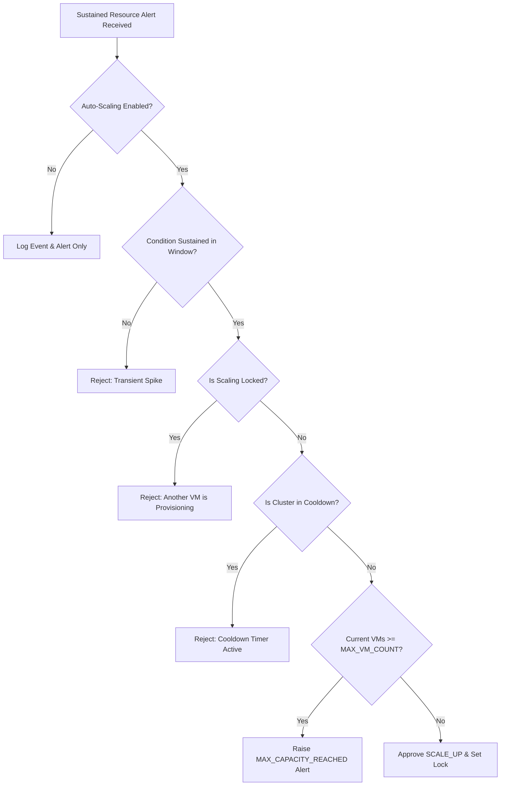

# Real-Time Linux Observability, Log Analytics & Auto-Scaling Platform
### Complete Architecture, Engineering & Operations Documentation

---

## Status & Implementation Legend
To provide complete transparency across components, features in this document are categorized as follows:
- `[IMPLEMENTED]`: Fully coded, tested, and runnable in the repository.
- `[PLANNED]`: Architected and designed; scheduled for subsequent development phases.
- `[OPTIONAL]`: Configurable enhancement (e.g., external Twilio SMS or Apache Kafka).
- `[PRODUCTION EXTENSION]`: Enterprise multi-region or hyper-scale cloud deployment extension.

---

## Table of Contents
1. [Executive Summary & Project Evolution](#1-executive-summary--project-evolution)
2. [Problem Statement & Solution Overview](#2-problem-statement--solution-overview)
3. [End-to-End System Architecture](#3-end-to-end-system-architecture)
4. [Continuous Linux VM Resource Monitoring](#4-continuous-linux-vm-resource-monitoring)
5. [Real-Time Streaming & Stream Processor](#5-real-time-streaming--stream-processor)
6. [Resource Shortage Decision Engine](#6-resource-shortage-decision-engine)
7. [Automatic VM Provisioning & Scaling Workflow](#7-automatic-vm-provisioning--scaling-workflow)
8. [Multi-Cloud Provisioning Abstraction Layer](#8-multi-cloud-provisioning-abstraction-layer)
9. [VM Lifecycle State Machine & Registration Subsystem](#9-vm-lifecycle-state-machine--registration-subsystem)
10. [Workload Distribution & Safe Scale-Down Protocol](#10-workload-distribution--safe-scale-down-protocol)
11. [Preserved Log Analytics Subsystem (Dual-Mode)](#11-preserved-log-analytics-subsystem-dual-mode)
12. [Dashboard Architecture & UI Panels](#12-dashboard-architecture--ui-panels)
13. [Complete REST API Reference](#13-complete-rest-api-reference)
14. [Platform Self-Observability](#14-platform-self-observability)
15. [Safety, Cost Protection & Failure Handling Matrix](#15-safety-cost-protection--failure-handling-matrix)
16. [Security & Access Control Architecture](#16-security--access-control-architecture)
17. [Configuration Guide & Environment Variables](#17-configuration-guide--environment-variables)
18. [Repository Structure](#18-repository-structure)
19. [Deployment Options](#19-deployment-options)
20. [Troubleshooting Guide](#20-troubleshooting-guide)
21. [Interview Orientation: "What Happens When CPU Reaches 95%?"](#21-interview-orientation-what-happens-when-cpu-reaches-95)

---

## 1. Executive Summary & Project Evolution

The **Real-Time Linux Observability, Log Analytics & Auto-Scaling Platform** is an enterprise-grade cloud-native monitoring and autonomous infrastructure platform.

```
┌─────────────────────────────────┐        ┌────────────────────────────────────────────────────────┐
│     AWS Cloud Log Analyzer      │        │ Real-Time Linux Observability & Auto-Scaling Platform  │
│  (Foundational Log Subsystem)   │ ────►  │     (Autonomous Observability, Streaming & Scaling)    │
│  • Ad-hoc log file uploads      │        │  • Continuous Linux kernel & metric collection         │
│  • Severity keyword parsing     │        │  • Sliding-window sustained shortage detection         │
│  • DynamoDB / local JSON logs   │        │  • VMware & AWS EC2 autonomous VM provisioning         │
│  • Reactive alerts via SNS/SMTP │        │  • Least-utilized healthy workload scheduling          │
└─────────────────────────────────┘        └────────────────────────────────────────────────────────┘
```

The platform originated as the **AWS Cloud Log Analyzer**, providing severity classification and dual-mode storage (local JSON / AWS DynamoDB). It has now evolved into an autonomous observability and auto-scaling engine that continuously monitors Linux virtual machines running in **VMware** and **AWS EC2**, evaluates multi-metric rolling windows, and automatically provisions new virtual machines when sustained resource exhaustion is confirmed.

100% of existing functionality—including JWT authentication, log upload, severity parsing, DynamoDB persistence, and interactive chart visualizations—has been preserved and integrated into a unified control plane.

---

## 2. Problem Statement & Solution Overview

### The Engineering Challenge
Modern enterprise applications running across hybrid virtualization (VMware) and public clouds (AWS) experience complex failure modes:
1. **Scattered Telemetry**: Infrastructure metrics (CPU, RAM, disk, load) and application logs (`syslog`, `auth.log`) live in disconnected silos.
2. **Knee-Jerk Auto-Scaling**: Naive auto-scalers provision costly virtual machines based on transient 5-second CPU spikes (e.g., code compilation or cron jobs), causing flapping and runaway billing.
3. **Delayed Incident Detection**: Relying on manual log inspection or delayed polling leads to extended service degradation and Out-Of-Memory (OOM) kernel panics.
4. **Hypervisor Vendor Lock-in**: Scaling controllers are often tightly coupled to proprietary public cloud APIs (e.g., AWS Auto Scaling Groups), making it difficult to auto-scale on-premises VMware vSphere development environments.

### The Solution
Our unified platform addresses these challenges through:
- **Continuous Metric Ingestion `[IMPLEMENTED]`**: Scrapes Prometheus Node Exporter endpoints and parses streaming Fluent Bit log records.
- **Sliding-Window Statistical Evaluation `[IMPLEMENTED]`**: Uses a 5-minute rolling window to differentiate transient spikes from sustained resource constraints.
- **Provider-Agnostic Provisioning Abstraction `[IMPLEMENTED]`**: An extensible `VMProvisioner` interface that supports both on-premises VMware virtualization (Layer 1) and AWS EC2 cloud instances (Layer 2).
- **Dynamic Registration & Heartbeat Watchdog `[IMPLEMENTED]`**: VMs self-register upon boot via cloud-init bootstrap and send periodic heartbeats to maintain health status.
- **Least-Utilized Workload Scheduling `[IMPLEMENTED]`**: Workloads are automatically routed to the healthiest, least-utilized VM in the active pool.
- **Safety Constraints & Cost Guards `[IMPLEMENTED]`**: Mandatory cooldown timers, concurrency locks, min/max VM ceilings, and safe `DRY_RUN_MODE`.

---

## 3. End-to-End System Architecture

The following diagram illustrates the complete data, streaming, decision, and provisioning pipeline:

```
                    VMware / AWS Infrastructure
                                │
                 ┌──────────────┴──────────────┐
                 ▼                             ▼
          [ Linux VM 1 ]                 [ Linux VM 2 ]
          ├─ Node Exporter               ├─ Node Exporter
          ├─ Fluent Bit                  ├─ Fluent Bit
          └─ Heartbeat Cron              └─ Heartbeat Cron
                 │                             │
                 └──────────────┬──────────────┘
                                ▼
                         [ Metrics & Logs ]
                                │
                                ▼
                       Kafka / Redpanda Bus
                     (or In-Memory Fallback)
                                │
                                ▼
                        Stream Processor
                  (5-Min Sliding Window Engine)
                                │
                 ┌──────────────┼──────────────┐
                 ▼              ▼              ▼
             Log Analysis   Resource       Anomaly
             (Syslog/Auth)  Analysis      Detection
                 │              │              │
                 └──────────────┼──────────────┘
                                ▼
                         Decision Engine
                (Checks: Sustained Window, Cooldown,
                     Scaling Lock, Max VMs)
                                │
                     ┌──────────┴──────────┐
                     ▼                     ▼
                Normal State        Resource Shortage
                                           │
                                           ▼
                                    Scaling Engine
                                           │
                           ┌───────────────┴───────────────┐
                           ▼                               ▼
                  VMware Provisioner              AWS EC2 Provisioner
                     (Layer 1 - Dev)                (Layer 2 - Cloud)
                           │                               │
                           └───────────────┬───────────────┘
                                           ▼
                                    New Linux VM
                                           │
                                           ▼
                                  Agent Registration
                                 (POST /api/hosts/register)
                                           │
                                           ▼
                                    Health Check
                                 (POST /api/hosts/{id}/heartbeat)
                                           │
                                           ▼
                                   Monitoring Pool
                             (Least-Utilized Scheduler)
                                           │
                                           ▼
                                  Storage & Analytics
                           ┌───────────────┼───────────────┐
                           ▼               ▼               ▼
                      Local / SQLite   DynamoDB           S3
                           │               │               │
                           └───────────────┼───────────────┘
                                           ▼
                                     Flask REST API
                                           │
                           ┌───────────────┴───────────────┐
                           ▼                               ▼
                    React Dashboard                    SNS / Email
              (Observability + Log Analyzer)         (Critical Alerts)
```

---

## 4. Continuous Linux VM Resource Monitoring

Rather than relying solely on periodic manual log uploads, the platform continuously monitors live Linux virtual machines running in VMware or AWS.

### 4.1 Monitored Metric Dimensions
| Subsystem | Metric Dimension | Collection Source | Impact / Failure Detected |
|---|---|---|---|
| **CPU** | Total CPU %, User CPU %, System CPU %, Idle CPU % | Prometheus Node Exporter | CPU saturation, infinite loops, runaway processes |
| **Memory** | Total RAM, Used RAM, Available RAM, Memory % | `/proc/meminfo` via Node Exporter | Memory leaks, Linux OOM killer invocations |
| **Disk** | Total Space, Used Space, Free Space, Disk % | `df` / `statvfs` via Node Exporter | Storage exhaustion, database write failures |
| **System Load** | 1-minute, 5-minute, 15-minute load averages | `/proc/loadavg` via Node Exporter | Thread queue backlog, I/O bottlenecks |
| **Disk I/O** | Read MB/s, Write MB/s | `/proc/diskstats` via Node Exporter | Storage latency degradation, disk thrashing |
| **Security** | Authentication failures, brute-force SSH, sudo errors | `/var/log/auth.log` via Fluent Bit | Unauthorized intrusions, privilege escalation |
| **Applications** | Service crashes, stack traces, segfaults | `/var/log/syslog` via Fluent Bit | Microservice crashes, core dumps, panics |

### 4.2 Configurable Resource Thresholds
Thresholds are fully configurable via environment variables:

| Resource | Warning Threshold | Critical Threshold | Default Duration Window | Config Variable |
|---|---|---|---|---|
| **CPU** | `> 75.0%` | `> 90.0%` | 5 consecutive minutes | `CPU_CRITICAL_THRESHOLD` |
| **Memory** | `> 75.0%` | `> 90.0%` | 5 consecutive minutes | `MEM_CRITICAL_THRESHOLD` |
| **Disk** | `> 80.0%` | `> 90.0%` | Sustained usage | `DISK_CRITICAL_THRESHOLD` |
| **System Load**| `> (Cores * 1.5)` | `> (Cores * 2.0)` | 5 consecutive minutes | Evaluated with CPU |

> [!IMPORTANT]
> **Anti-Spike Protection Principle**: A single instantaneous CPU spike (e.g., 95% CPU for 5 seconds during an archive extraction) will **never** trigger VM provisioning. Auto-scaling requires sustained elevated utilization over the rolling time window.

---

## 5. Real-Time Streaming & Stream Processor

### 5.1 Hybrid Event Stream Bus (`EventStream`)
Located in [backend/streaming/event_stream.py](file:///c:/Users/harsh/OneDrive/Desktop/aws/AWS_LogAnalyzer/backend/streaming/event_stream.py):
- **Production Mode**: Publishes and subscribes to Apache Kafka or Redpanda topics (`linux-metrics` and `linux-logs`).
- **Resilient Fallback Mode**: If Kafka is unreachable or not configured (e.g., during offline VMware development), the system automatically falls back to an in-memory ring-buffer (`collections.deque(maxlen=5000)`). The platform remains fully operational without external broker dependencies.

### 5.2 Stream Processor (`StreamProcessor`)
Located in [backend/streaming/stream_processor.py](file:///c:/Users/harsh/OneDrive/Desktop/aws/AWS_LogAnalyzer/backend/streaming/stream_processor.py):
- Maintains a thread-safe sliding window (default: 300 seconds / 5 minutes) of metric samples for every registered host.
- Computes window statistical aggregates:
  - $\text{Rolling Mean CPU} = \frac{1}{N} \sum_{i=1}^{N} \text{CPU}_i$
  - $\text{Rolling Mean Memory} = \frac{1}{N} \sum_{i=1}^{N} \text{Memory}_i$
  - Sustained Threshold Flag: Evaluates whether $\ge 3$ consecutive samples remain above the critical limit across the window duration.

---

## 6. Resource Shortage Decision Engine

Located in [backend/scaling/decision_engine.py](file:///c:/Users/harsh/OneDrive/Desktop/aws/AWS_LogAnalyzer/backend/scaling/decision_engine.py):

The **Decision Engine** acts as the cluster gatekeeper. When a host triggers a critical metric alert, the decision engine evaluates the following checklist before approving a scale-up:



### Safety Rules Enforced:
1. **Scaling Lock**: Only one VM may be provisioned at any given moment. Prevents racing threads from double-creating infrastructure.
2. **Cooldown Period**: A mandatory timer (default: `COOLDOWN_PERIOD=300` seconds) must elapse after any scaling action before another evaluation can proceed.
3. **Cluster Capacity Ceilings**:
   - `MIN_VM_COUNT`: Lower bound (default: 1). Prevents scale-down from decommissioning the last host.
   - `MAX_VM_COUNT`: Upper bound (default: 5). Protects organizations from runaway cloud billing.
4. **Dry-Run Mode**: When `DRY_RUN_MODE=true` (the default for development), all evaluations, logs, and database records are generated, but hypervisor API calls are simulated safely.

---

## 7. Automatic VM Provisioning & Scaling Workflow

When resource exhaustion is verified, the platform executes a 17-step autonomous workflow:

```
[ Step 1 ] Prometheus Node Exporter & Fluent Bit collect metrics on Linux VM.
    ↓
[ Step 2 ] Telemetry is published to Kafka/Redpanda topic or In-Memory Bus.
    ↓
[ Step 3 ] Stream Processor consumes metric samples and updates 5-min sliding window.
    ↓
[ Step 4 ] Stream Processor detects sustained CPU > 90% and Memory > 90%.
    ↓
[ Step 5 ] Decision Engine verifies auto-scaling toggle is active.
    ↓
[ Step 6 ] Decision Engine confirms cluster is NOT in cooldown period.
    ↓
[ Step 7 ] Decision Engine confirms scaling lock is free (no concurrent provisioning).
    ↓
[ Step 8 ] Decision Engine verifies current VM count < MAX_VM_COUNT.
    ↓
[ Step 9 ] Scaling Controller dispatches provision request to active VMProvisioner.
    ↓
[ Step 10] Provisioner initiates VM creation (VMware clone or AWS EC2 run_instances).
    ↓
[ Step 11] Virtual machine boots into guest operating system.
    ↓
[ Step 12] Cloud-init executes startup script (vm_template_init.sh).
    ↓
[ Step 13] Startup script configures and launches Node Exporter and Fluent Bit services.
    ↓
[ Step 14] New VM self-registers via POST /api/hosts/register.
    ↓
[ Step 15] Watchdog confirms heartbeat and transitions host to ACTIVE.
    ↓
[ Step 16] Workload Scheduler adds new VM to pool and routes incoming tasks to it.
    ↓
[ Step 17] Scaling audit event is persisted; notifications are dispatched via SNS/Email.
```

---

## 8. Multi-Cloud Provisioning Abstraction Layer

To ensure the business logic does not depend directly on any specific hypervisor, the platform implements an abstract driver pattern:

```
                      VMProvisioner (Abstract Base Class)
                                     │
                ┌────────────────────┴────────────────────┐
                ▼                                         ▼
        VMwareProvisioner                         AWSProvisioner
    (Layer 1 - Development)                    (Layer 2 - Production)
    • VMware vSphere / REST API                • AWS Boto3 EC2 API
    • VM Template Cloning                      • Launch Templates & AMIs
    • Network Adapter Config                   • IAM Instance Profiles
    • Asynchronous State Machine               • User-Data Cloud-Init
```

### Why This Abstraction Exists:
1. **Decoupled Architecture**: The `ScalingController` and `DecisionEngine` interact strictly with `VMProvisioner.provision_vm()` and `deprovision_vm()`.
2. **Environment Portability**: During local and VMware development, developers test auto-scaling against VMware templates or the built-in state orchestrator without paying AWS fees. In staging and production, setting `PROVISIONER_TYPE=aws` switches to native EC2 provisioning without altering any core logic.

---

## 9. VM Lifecycle State Machine & Registration Subsystem

### 9.1 VM Lifecycle States
Every virtual machine transitions through a deterministic finite state machine:

```
[ Normal Lifecycle ]
PROVISIONING ──► BOOTING ──► CONFIGURING ──► HEALTH_CHECK ──► ACTIVE

[ Failure States ]
PROVISIONING ──► FAILED
ACTIVE ──► (Missing Heartbeat > 90s) ──► UNHEALTHY
UNHEALTHY ──► (Heartbeat Restored) ──► ACTIVE

[ Termination Lifecycle ]
ACTIVE / UNHEALTHY ──► TERMINATING ──► TERMINATED
```

### 9.2 Host Self-Registration
Upon completing cloud-init boot, the VM invokes:
```http
POST /api/hosts/register
Content-Type: application/json
X-Agent-Key: linux-agent-secret-key

{
  "hostname": "linux-vm-02",
  "ip": "192.168.1.102",
  "os": "Ubuntu 22.04 LTS",
  "cpu": 4,
  "memory": 8192,
  "disk": 60,
  "provider": "vmware"
}
```

### 9.3 Heartbeat Watchdog
Every 60 seconds, active VMs issue a beacon:
```http
POST /api/hosts/{host_id}/heartbeat
Content-Type: application/json

{
  "metrics": {
    "cpu_pct": 22.4,
    "memory_pct": 36.1,
    "disk_pct": 45.0,
    "load_1m": 0.42
  }
}
```
If no heartbeat is received within 90 seconds, the background supervisor transitions the host to `UNHEALTHY` and alerts the operations team.

---

## 10. Workload Distribution & Safe Scale-Down Protocol

### 10.1 Workload Distribution
A newly provisioned VM is immediately registered in the active scheduling pool. The platform implements the **Least-Utilized Healthy VM** selection strategy in [backend/scaling/workload_scheduler.py](file:///c:/Users/harsh/OneDrive/Desktop/aws/AWS_LogAnalyzer/backend/scaling/workload_scheduler.py):

$$\text{Load Score} = (\text{CPU}\% \times 0.5) + (\text{Memory}\% \times 0.3) + (\text{Active Workloads} \times 10.0)$$

Incoming workloads are routed to the healthy VM with the lowest load score.

### 10.2 Safe Scale-Down Protocol
To prevent resource waste when traffic recedes:
1. **Evaluation Condition**: If a VM exhibits $\text{CPU} < 30\%$ and $\text{Memory} < 40\%$ for **15 consecutive minutes**, it is flagged as a candidate for scale-down.
2. **Safety Protections Enforced**:
   - **Minimum VM Guard**: If $\text{Active VMs} \le \text{MIN\_VM\_COUNT}$ (default: 1), scale-down is **strictly prohibited**. The last healthy VM will never be terminated.
   - **Workload Draining**: If active workloads are present, the host status is set to `DRAINING` to finish tasks before decommission.
   - **Cooldown**: Scaling cooldown is applied to prevent flapping.

---

## 11. Preserved Log Analytics Subsystem (Dual-Mode)

The foundational log processing capabilities remain completely functional.

### 11.1 Dual-Storage Mode
- **Local Storage Mode (`STORAGE_MODE=local`)**:
  - Log files reside in `backend/logs/`.
  - Structured alerts and statistics persist in `backend/local_storage/alerts.json` and `stats.json`.
  - Zero AWS credentials required; perfect for offline development.
- **AWS Cloud Storage Mode (`STORAGE_MODE=aws`)**:
  - Ingests into Amazon DynamoDB tables (`CloudLogs`, `CloudAlerts`, `CloudStats`).
  - Supports CloudWatch Logs subscription filters triggering [lambda/log_processor.py](file:///c:/Users/harsh/OneDrive/Desktop/aws/AWS_LogAnalyzer/lambda/log_processor.py).
  - Broadcasts critical alerts to Amazon SNS topic (`log-alerts`).

### 11.2 Supported Log Formats
The regex parser ([backend/local_log_reader.py](file:///c:/Users/harsh/OneDrive/Desktop/aws/AWS_LogAnalyzer/backend/local_log_reader.py)) automatically processes:
```text
[2026-09-23 10:30:45] CRITICAL Emergency shutdown initiated
2026-09-23 10:30:45 ERROR Database connection pool exhausted
{"timestamp": "2026-09-23T10:30:45Z", "level": "WARNING", "message": "High memory consumption"}
```

---

## 12. Dashboard Architecture & UI Panels

The React 18 user interface features a two-tab navigation bar:

```
┌────────────────────────────────────────────────────────────────────────────────────────────────┐
│  [Logo] Linux Observability & Scaling Platform                                [Theme] [Logout] │
│         Tabs: [🖥️ Observability & Auto-Scaling]  [📜 Log Analytics & Alerts]                  │
└────────────────────────────────────────────────────────────────────────────────────────────────┘
```

### 12.1 Linux Observability Tab Components
1. **System Overview Cards**: Real-time totals for Total VMs, Active VMs, Unhealthy VMs, Provisioning VMs, Cluster Mean CPU %, Memory %, and Disk %.
2. **Resource Telemetry Line Chart**: Interactive multi-metric Chart.js graphs with tabs for CPU, Memory, Disk, Load Average, and Disk I/O over time.
3. **Monitored Linux VM Table**:
   | Host | Provider / IP | Status | CPU | Memory | Disk | Load 1m | Workloads | Heartbeat |
   |---|---|---|---|---|---|---|---|---|
   | `linux-vm-01` | VMware / 192.168.1.101 | `ACTIVE` | 34.5% [=== ] | 48.2% [==== ] | 52.0% | 1.15 | 0 | 10:32:15 AM |
   | `linux-vm-02` | AWS / 10.0.4.82 | `ACTIVE` | 18.5% [== ] | 24.0% [== ] | 15.0% | 0.22 | 1 | 10:32:14 AM |
4. **Auto-Scaling Control Panel**: Displays scaling state (`ACTIVE`, `COOLDOWN`, `PROVISIONING`), minimum/maximum limits, live countdown clock for remaining cooldown seconds, `DRY_RUN_MODE` badge, and manual trigger buttons.
5. **Active Incidents Panel**: Cards for currently active alarms (`RESOURCE_HIGH_CPU`, `RESOURCE_HIGH_MEMORY`) showing threshold vs actual values, duration, and action taken.
6. **VM Provisioning Pipeline**: Live status tracker with a step-by-step audit checklist for ongoing jobs (`ALLOCATE_RESOURCE` $\to$ `CLONE_TEMPLATE` $\to$ `ASSIGN_NETWORK` $\to$ `INSTALL_AGENTS` $\to$ `HEALTH_CHECK`).

### 12.2 Log Analytics Tab Components
- Stat cards: Total Logs, Errors, Warnings, Critical Counts.
- Log level distribution pie chart and error frequency line chart.
- Search and severity filter bar with CSV export.
- Modal for ad-hoc log file uploads.

---

## 13. Complete REST API Reference

All requests accept and return JSON. Endpoints (except `/api/login` and `/api/health`) accept JWT Bearer authentication. Machine agent endpoints also support `X-Agent-Key`.

### 13.1 Host Discovery & Heartbeats
```http
GET /api/hosts
```
*Returns all registered Linux hosts with status and utilization.*

```http
GET /api/hosts/{host_id}
```
*Returns full profile and utilization for a specific host.*

```http
POST /api/hosts/register
Content-Type: application/json

{
  "hostname": "linux-vm-02",
  "ip": "192.168.1.20",
  "os": "Ubuntu 22.04 LTS",
  "cpu": 4,
  "memory": 8192,
  "disk": 60,
  "provider": "vmware"
}
```

```http
POST /api/hosts/{host_id}/heartbeat
Content-Type: application/json

{
  "metrics": { "cpu_pct": 32.1, "memory_pct": 45.0, "load_1m": 0.85 }
}
```

### 13.2 Resource Metrics
```http
GET /api/resources
```
*Returns cluster-wide aggregated statistics (mean CPU, RAM, disk, total cores).*

```http
GET /api/resources/{metric_type}?limit=50
```
*Returns time-series history for charts: `cpu`, `memory`, `disk`, `load`, or `io`.*

```http
POST /api/metrics/ingest
Content-Type: application/json

{
  "host_id": "host_vmware_01",
  "cpu_pct": 94.2,
  "memory_pct": 91.5,
  "load_1m": 7.45
}
```

### 13.3 Auto-Scaling & Incidents
```http
GET /api/scaling/status
```
*Returns scaling state, lock, cooldown timer, and min/max boundaries.*

```http
GET /api/scaling/history
```
*Returns audit logs for all scale-up and scale-down operations.*

```http
POST /api/scaling/scale-up
Content-Type: application/json

{ "reason": "Operator manual trigger" }
```

```http
POST /api/scaling/scale-down
Content-Type: application/json

{ "host_id": "host_vmware_02", "reason": "Operator decommission" }
```

```http
GET /api/incidents
GET /api/incidents/active
```
*Returns incident histories and currently active alarms.*

```http
GET /api/provisioning
GET /api/provisioning/{provisioning_id}
```
*Returns all ongoing and completed VM provisioning tasks with step logs.*

### 13.4 Preserved Log Analyzer APIs
```http
POST /api/login
POST /api/upload
GET  /api/logs?limit=50&severity=CRITICAL
POST /api/logs
GET  /api/alerts
GET  /api/stats
POST /api/stats/refresh
GET  /api/health
```

---

## 14. Platform Self-Observability

The platform monitors its own operational health via:

```http
GET /api/system/health
```

### Example Response:
```json
{
  "status": "healthy",
  "timestamp": "2026-09-23T14:02:44.653217Z",
  "api": "healthy",
  "streaming": "healthy (in-memory)",
  "storage": "healthy",
  "provisioning": "healthy",
  "agents": {
    "total": 2,
    "active": 2,
    "unhealthy": 0
  }
}
```

### Monitored Subsystems:
- **API Health**: Latency, request throughput, error responses.
- **Streaming Pipeline**: Broker connectivity, message queue lag.
- **Storage Backend**: Local JSON atomic write accessibility or DynamoDB connectivity.
- **Provisioning Engine**: Hypervisor driver readiness and pending job counts.
- **Agent Telemetry**: Active vs unhealthy heartbeat beacon counts.

---

## 15. Safety, Cost Protection & Failure Handling Matrix

| Failure Mode | Detection Mechanism | Built-in Autonomous Mitigation |
|---|---|---|
| **VM Creation Storm (Flapping)** | Rapid alert trigger | Enforces strict `COOLDOWN_PERIOD` (300s) and hard ceiling `MAX_VM_COUNT`. |
| **Transient CPU Spike** | 5-minute rolling window | Requires sustained conditions across multiple samples. Single spikes are discarded. |
| **VMware / AWS API Outage** | Boto3 / API try-catch block | Marks job as `FAILED`, releases scaling lock, sends incident alert, and keeps existing VMs active. |
| **Agent / Network Outage** | 90-second heartbeat watchdog | Marks host as `UNHEALTHY`, excludes it from workload scheduling, and notifies operations. |
| **Broker (Kafka) Unreachable** | Connection timeout | Automatically redirects to thread-safe in-memory ring-buffer; zero message loss. |
| **Accidental Decommissioning** | Minimum VM constraint | Rejects scale-down if active hosts $\le$ `MIN_VM_COUNT` (minimum 1). Never kills the last VM. |
| **Development Cost Accidents** | `DRY_RUN_MODE=true` default | Simulates complete provisioning logic without incurring infrastructure costs. |

---

## 16. Security & Access Control Architecture

1. **JWT Authentication**: All user access requires signed JSON Web Tokens with 24-hour expiration.
2. **Restricted Scaling Endpoints**: Hazardous endpoints (`/api/scaling/scale-up`, `/api/scaling/scale-down`) are protected and require administrator authorization.
3. **No Hard-Coded Credentials**: AWS credentials must never be committed to source control. In AWS mode, the platform relies on IAM instance profiles (`LogAnalyzerInstanceProfile`).
4. **Machine Agent Authentication**: Bootstrap registration and heartbeat calls require an `X-Agent-Key` header verified against environment configuration.
5. **Audit Logging**: Every scaling action, whether successful or failed, writes an immutable record to `CloudScalingEvents`.

---

## 17. Configuration Guide & Environment Variables

| Variable Name | Default Value | Description |
|---|---|---|
| `JWT_SECRET_KEY` | `your-secret-key...` | Cryptographic secret for signing JWT tokens |
| `STORAGE_MODE` | `local` | Storage mode: `local` (flat files) or `aws` (DynamoDB) |
| `PROVISIONER_TYPE` | `vmware` | VM provider: `vmware` or `aws` |
| `AUTO_SCALING_ENABLED` | `true` | Master switch for automated scale-up and scale-down |
| `DRY_RUN_MODE` | `true` | When true, simulates provisioning without creating real VMs |
| `MIN_VM_COUNT` | `1` | Minimum number of active VMs in the monitoring cluster |
| `MAX_VM_COUNT` | `5` | Maximum number of VMs allowed in the cluster |
| `COOLDOWN_PERIOD` | `300` | Cooldown period in seconds between scaling actions |
| `CPU_CRITICAL_THRESHOLD` | `90.0` | CPU % sustained threshold to trigger scale-up evaluation |
| `MEM_CRITICAL_THRESHOLD` | `90.0` | Memory % sustained threshold to trigger scale-up evaluation |
| `KAFKA_BOOTSTRAP_SERVERS` | `""` | Kafka / Redpanda broker address (e.g. `localhost:9092`) |
| `AWS_REGION` | `us-east-1` | AWS region for DynamoDB, EC2, and SNS |
| `AGENT_REGISTRATION_KEY` | `linux-agent-secret-key` | Shared secret key for agent self-registration |

---

## 18. Repository Structure

```text
AWS_LogAnalyzer/
├── backend/
│   ├── app.py                         # Upgraded Flask entrypoint & background supervisor
│   ├── local_storage_manager.py       # Thread-safe atomic JSON storage manager
│   ├── aws_storage_adapter.py         # DynamoDB, CloudWatch & SNS adapter
│   ├── notification_service.py        # Email, SMS & structured scaling alert engine
│   ├── storage_factory.py             # Storage mode factory (Local vs AWS)
│   ├── requirements.txt               # Backend Python dependencies
│   ├── Dockerfile                     # Backend container definition
│   ├── test_auto_scaling.py           # E2E test harness & interview demonstration
│   ├── models/
│   │   └── entities.py                # Data models for Hosts, Metrics, Incidents, Jobs
│   ├── routes/
│   │   ├── hosts_bp.py                # /api/hosts, registration & heartbeats
│   │   ├── metrics_bp.py              # /api/resources & metric ingestion
│   │   ├── scaling_bp.py              # /api/scaling, incidents & provisioning
│   │   └── health_bp.py               # /api/system/health self-observability
│   ├── streaming/
│   │   ├── event_stream.py            # Kafka/Redpanda & in-memory event bus
│   │   └── stream_processor.py        # 5-minute sliding window metric aggregator
│   ├── scaling/
│   │   ├── decision_engine.py         # Sustained threshold checks, cooldown & limits
│   │   ├── scaling_controller.py      # Provisioning orchestrator & state machine
│   │   └── workload_scheduler.py      # Least-utilized healthy VM scheduler
│   ├── provisioners/
│   │   ├── base.py                    # VMProvisioner abstract interface
│   │   ├── vmware_provisioner.py      # Layer 1: VMware lifecycle orchestrator
│   │   ├── aws_provisioner.py         # Layer 2: AWS EC2 Boto3 provisioner
│   │   └── factory.py                 # Provisioner factory
│   └── agents/
│       ├── node_exporter_collector.py # Node Exporter Prometheus metric parser
│       ├── fluent_bit_parser.py       # Linux syslog/auth.log security parser
│       └── vm_template_init.sh        # Linux cloud-init bootstrap script
│
├── frontend/
│   ├── src/
│   │   ├── components/
│   │   │   ├── LinuxObservability.js  # Cluster overview, host table, charts, scaling panels
│   │   │   ├── Dashboard.js           # Main container with tabbed switching
│   │   │   └── Login.js               # JWT login component
│   │   ├── App.js                     # Root component & theme provider
│   │   └── index.js
│   ├── Dockerfile
│   └── package.json
│
├── terraform/
│   ├── main.tf                        # DynamoDB tables, EC2 SG, IAM roles, Lambda
│   ├── variables.tf                   # min_instances, max_instances, instance_type
│   └── outputs.tf
├── docker-compose.yml                 # Multi-container orchestration
├── README.md                          # Repository overview & quick start
└── PROJECT_DOCUMENTATION.md           # This document
```

---

## 19. Deployment Options

### Option 1: Local Development
```bash
# 1. Start Backend
cd backend
python -m venv venv && source venv/bin/activate  # or venv\Scripts\activate on Windows
pip install -r requirements.txt
python app.py

# 2. Start Frontend (New terminal)
cd frontend
npm install
npm start
```
- Access Dashboard: `http://localhost:3000`
- API Gateway: `http://localhost:5000`

### Option 2: Docker Compose
```bash
# Launch full stack (Backend + Frontend)
docker-compose up -d --build

# Inspect operational logs
docker-compose logs -f backend
```

### Option 3: AWS Terraform Deployment
```bash
cd terraform
terraform init
terraform plan
terraform apply
```

---

## 20. Troubleshooting Guide

### 1. New Host Not Appearing in Dashboard
- Verify cloud-init completed: `cat /var/log/cloud-init-output.log`
- Check network reachability to `/api/hosts/register`
- Confirm `X-Agent-Key` matches `AGENT_REGISTRATION_KEY` in `.env`

### 2. Auto-Scaling Not Provisioning VM
- Check `/api/scaling/status` to determine:
  - Is `auto_scaling_enabled` set to `false`?
  - Is the cluster in `cooldown`? (Inspect `cooldown_remaining_seconds`)
  - Has `max_vm_count` been reached?
  - Was the CPU condition sustained for the full 5-minute window?

### 3. Kafka Broker Connection Errors
- If Kafka is offline, the system automatically falls back to the internal in-memory ring-buffer.
- Check `/api/system/health` — the `streaming` field will indicate `healthy (in-memory)`.

---

## 21. Interview Orientation: "What Happens When CPU Reaches 95%?"

Use this structured narrative when presenting the platform during technical architectural interviews:

### Step 1: Metric Collection on the Linux VM
- Prometheus **Node Exporter** running on `linux-vm-01` continuously samples kernel performance metrics from `/proc/stat` and `/proc/loadavg`.
- **Fluent Bit** tails `/var/log/syslog` and `/var/log/auth.log` for anomalous events.

### Step 2: Ingestion & Streaming
- The host agent sends samples to the metrics ingestion endpoint (`POST /api/metrics/ingest`), which publishes the record onto the event streaming pipeline (Kafka topic or in-memory event bus).

### Step 3: Sliding-Window Aggregation & Anti-Spike Protection
- The **Stream Processor** consumes the telemetry and appends it to a 5-minute sliding time window for `linux-vm-01`.
- If CPU spikes to 95% for only a few seconds, the rolling mean remains unaffected — **no false-alarm scale-up occurs**.

### Step 4: Sustained Shortage Detection
- When CPU utilization remains above 90% across consecutive samples spanning the window duration, the Stream Processor flags a sustained breach and invokes the **Decision Engine**.

### Step 5: Constraint & Policy Verification
- The **Decision Engine** evaluates safety constraints:
  - Verifies that auto-scaling is enabled.
  - Confirms no other VM is currently in a provisioning state (checks the scaling lock).
  - Verifies the cluster is not in cooldown (`COOLDOWN_PERIOD=300s`).
  - Verifies the current VM count does not exceed `MAX_VM_COUNT`.

### Step 6: Provisioning Execution
- The **Scaling Controller** acquires the lock and calls the configured `VMProvisioner`:
  - In **VMware mode**: Clones the Linux VM template, assigns network identity, and starts the virtual machine.
  - In **AWS mode**: Invokes `ec2.run_instances()` with cloud-init user-data (`vm_template_init.sh`) and attaches IAM roles.

### Step 7: Self-Registration & Health Verification
- As `linux-vm-02` finishes booting, its cloud-init script starts Node Exporter and Fluent Bit, then issues `POST /api/hosts/register`.
- The new VM begins emitting periodic heartbeats (`POST /api/hosts/{id}/heartbeat`).
- Upon acknowledging the first heartbeat, the platform transitions the VM state from `HEALTH_CHECK` to `ACTIVE`.

### Step 8: Workload Balancing & Alert Broadcast
- The **Workload Scheduler** detects the new VM in the pool and routes subsequent tasks to it using the *Least-Utilized Healthy VM* algorithm.
- The **Notification Service** issues structured critical alerts via Amazon SNS, Email, and SMS.
- The React dashboard automatically updates its topology, showing the new active host and updated cluster capacity.
