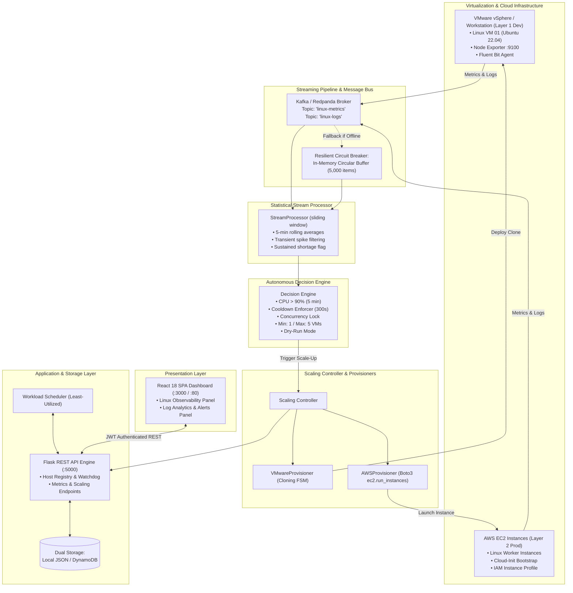

# Real-Time Linux Observability, Log Analytics & Auto-Scaling Platform
*(Formerly AWS Cloud Log Analyzer)*

A production-ready, full-stack Linux infrastructure observability, log monitoring, and autonomous scaling platform built with Flask, React, Docker, and VMware/AWS virtualization. It continuously monitors Linux virtual machines (CPU, Memory, Disk, Load Average, Disk I/O), parses streaming logs, and automatically provisions new virtual machines when sustained resource constraints are detected.


---

## Overview

The platform combines real-time infrastructure telemetry, statistical anomaly detection, and automated scaling controllers:

- **Linux VM Monitoring**: Continuous Prometheus Node Exporter metrics (CPU, RAM, Disk, Load, I/O) and Fluent Bit log shipping.
- **Autonomous VM Provisioning**: Decoupled multi-cloud scaling engine supporting **VMware vSphere** (Layer 1 Development) and **AWS EC2** (Layer 2 Production).
- **Anti-Spike Protection**: 5-minute sliding window prevents premature scale-ups on transient spikes.
- **Dynamic Registration & Heartbeats**: VMs self-register on boot with cloud-init and maintain health beacons.
- **Workload Scheduler**: Routes tasks to the "least-utilized healthy VM".
- **Log Analytics Subsystem**: Preserves full AWS Cloud Log Analyzer functionality (DynamoDB/local storage, JWT auth, severity classification, and charts).

---

## Key Features

- **Continuous Linux Telemetry**: Scrapes Node Exporter and Fluent Bit across all cluster VMs
- **Autonomous Auto-Scaling**: Multi-threshold sustained evaluation with cooldown and safety locks
- **Multi-Cloud Provisioning Abstraction**: Supports both VMware virtual machines and AWS EC2 instances
- **Dual Storage Mode**: Local file/JSON mode for offline dev and AWS mode (DynamoDB, CloudWatch, SNS, Lambda)
- **Workload Balancer**: Dispatches incoming workloads to the least-utilized healthy host
- **Interactive Dashboard**: Tabbed interface for Observability & Auto-Scaling and Log Analytics & Alerts
- **Platform Self-Health**: Dedicated `/api/system/health` telemetry endpoint
- **Docker Compose & Terraform**: Ready for local containerized deployment and automated cloud provisioning

---

## End-to-End System Architecture



---

## Tech Stack

### Core & Virtualization
- **Operating System**: Linux (Ubuntu 22.04 LTS / Debian)
- **Virtualization**: VMware vSphere / Workstation & AWS EC2
- **Language**: Python 3.11+ / 3.12+
- **Backend Framework**: Flask 3.0, Flask-JWT-Extended, Flask-CORS
- **WSGI / Server**: Gunicorn 21.2

### Observability & Streaming
- **System Metrics**: Prometheus Node Exporter (Kernel `/proc` scraper)
- **Log Collection**: Fluent Bit (Tail `/var/log/syslog`, `/var/log/auth.log`)
- **Streaming Bus**: Apache Kafka / Redpanda (with automatic in-memory ring-buffer fallback)
- **Stream Processing**: Multi-threaded rolling window statistical aggregator

### Cloud & Infrastructure as Code
- **AWS SDK**: Boto3 (EC2, DynamoDB, CloudWatch Logs, SNS)
- **Infrastructure as Code**: Terraform (~> 5.0)
- **Containers**: Docker & Docker Compose
- **Web Server / Reverse Proxy**: Nginx

### Frontend
- **Framework**: React 18.2 SPA
- **Styling**: Tailwind CSS
- **Data Visualization**: Chart.js 4.4 & React-Chartjs-2
- **Icons**: Lucide React
- **HTTP Client**: Axios

---

## Repository Structure

```text
AWS_LogAnalyzer/
├── backend/
│   ├── app.py                         # Upgraded Flask entrypoint & background supervisor
│   ├── local_storage_manager.py       # Thread-safe atomic JSON storage manager
│   ├── aws_storage_adapter.py         # DynamoDB, CloudWatch & SNS adapter
│   ├── notification_service.py        # Email, SMS & structured scaling alert engine
│   ├── storage_factory.py             # Storage mode factory (Local vs AWS)
│   ├── requirements.txt               # Backend Python dependencies
│   ├── Dockerfile                     # Backend container definition
│   ├── test_auto_scaling.py           # E2E test harness & interview demonstration
│   ├── models/
│   │   └── entities.py                # Data models for Hosts, Metrics, Incidents, Jobs
│   ├── routes/
│   │   ├── hosts_bp.py                # /api/hosts, registration & heartbeats
│   │   ├── metrics_bp.py              # /api/resources & metric ingestion
│   │   ├── scaling_bp.py              # /api/scaling, incidents & provisioning
│   │   └── health_bp.py               # /api/system/health self-observability
│   ├── streaming/
│   │   ├── event_stream.py            # Kafka/Redpanda & in-memory event bus
│   │   └── stream_processor.py        # 5-minute sliding window metric aggregator
│   ├── scaling/
│   │   ├── decision_engine.py         # Sustained threshold checks, cooldown & limits
│   │   ├── scaling_controller.py      # Provisioning orchestrator & state machine
│   │   └── workload_scheduler.py      # Least-utilized healthy VM scheduler
│   ├── provisioners/
│   │   ├── base.py                    # VMProvisioner abstract interface
│   │   ├── vmware_provisioner.py      # Layer 1: VMware lifecycle orchestrator
│   │   ├── aws_provisioner.py         # Layer 2: AWS EC2 Boto3 provisioner
│   │   └── factory.py                 # Provisioner factory
│   └── agents/
│       ├── node_exporter_collector.py # Node Exporter Prometheus metric parser
│       ├── fluent_bit_parser.py       # Linux syslog/auth.log security parser
│       └── vm_template_init.sh        # Linux cloud-init bootstrap script
│
├── frontend/
│   ├── src/
│   │   ├── components/
│   │   │   ├── LinuxObservability.js  # Cluster overview, host table, charts, scaling panels
│   │   │   ├── Dashboard.js           # Main container with tabbed switching
│   │   │   └── Login.js               # JWT login component
│   │   ├── App.js                     # Root component & theme provider
│   │   └── index.js
│   ├── Dockerfile
│   └── package.json
│
├── terraform/
│   ├── main.tf                        # DynamoDB tables, EC2 SG, IAM roles, Lambda
│   ├── variables.tf                   # min_instances, max_instances, instance_type
│   └── outputs.tf
├── docker-compose.yml                 # Multi-container orchestration
├── README.md                          # Repository overview & quick start
└── PROJECT_DOCUMENTATION.md           # Master technical documentation
```

---

## Getting Started

### Prerequisites
- Python 3.11+ (Python 3.12 supported)
- Node.js 18+ and npm
- Docker Desktop (optional for containerized deployment)
- AWS CLI & credentials (optional for AWS mode)

---

## Local Development Setup

### 1. Clone the repository
```bash
git clone <repo-url>
cd AWS_LogAnalyzer
```

### 2. Configure Environment Variables
Create a `.env` file in the root or `backend/` directory:
```env
JWT_SECRET_KEY=local-secret-key-for-development
STORAGE_MODE=local
PROVISIONER_TYPE=vmware
AUTO_SCALING_ENABLED=true
DRY_RUN_MODE=true
MIN_VM_COUNT=1
MAX_VM_COUNT=5
COOLDOWN_PERIOD=300
CPU_CRITICAL_THRESHOLD=90.0
MEM_CRITICAL_THRESHOLD=90.0
```

### 3. Install & Start Backend
```bash
cd backend
pip install -r requirements.txt
python app.py
```
*Backend runs at: `http://127.0.0.1:5000`*

### 4. Install & Start Frontend
In a new terminal:
```bash
cd frontend
npm install
npm start
```
*Frontend runs at: `http://127.0.0.1:3000`*

### 5. Access the Platform
- Open your browser to `http://localhost:3000`
- Login using demo credentials:
  - **Username**: `admin`
  - **Password**: `admin123`
- Switch between tabs:
  - **Observability & Auto-Scaling**: Live Linux telemetry, VM table, scaling controls, incident tracker
  - **Log Analytics & Alerts**: Log search, filters, pie/line charts, and file upload

---

## Running the End-to-End Simulation Harness

To verify the complete autonomous auto-scaling pipeline without waiting for live hardware alerts, run:

```bash
cd backend
python test_auto_scaling.py
```

This verifies:
1. Cluster initialization (1 active Linux VM).
2. Anti-spike filtering (transient 95% CPU spike ignored).
3. Sustained multi-sample saturation across sliding window.
4. Decision Engine threshold and cooldown validation.
5. Provisioner execution and lifecycle step logging.
6. Guest VM self-registration via `POST /api/hosts/register`.
7. Heartbeat reception and health promotion to `ACTIVE`.
8. Workload Scheduler rebalancing task to the new VM.

---

## Complete API Reference

| Method | Endpoint | Description |
|---|---|---|
| `POST` | `/api/login` | User authentication; returns JWT access token |
| `GET` | `/api/hosts` | List all registered Linux hosts with status and utilization |
| `GET` | `/api/hosts/{id}` | Retrieve details of a specific host |
| `POST` | `/api/hosts/register` | Linux VM self-registration endpoint |
| `POST` | `/api/hosts/{id}/heartbeat`| Periodic heartbeat beacon from guest agent |
| `GET` | `/api/resources` | Cluster-wide aggregated metrics (mean CPU, RAM, disk, load) |
| `GET` | `/api/resources/{type}` | Time-series metric history (`cpu`, `memory`, `disk`, `load`, `io`) |
| `POST` | `/api/metrics/ingest` | Telemetry ingestion endpoint for Node Exporter |
| `GET` | `/api/scaling/status` | Current scaling state, cooldown remaining, min/max limits |
| `GET` | `/api/scaling/history` | Historical audit log of scale-up and scale-down actions |
| `POST` | `/api/scaling/scale-up` | Administrator manual scale-up trigger |
| `POST` | `/api/scaling/scale-down`| Administrator manual scale-down trigger |
| `GET` | `/api/incidents` | Complete incident log |
| `GET` | `/api/incidents/active` | Currently active critical alarms |
| `GET` | `/api/provisioning` | List all VM provisioning jobs and progress steps |
| `GET` | `/api/provisioning/{id}` | Status of a specific provisioning task |
| `POST` | `/api/workloads/assign` | Dispatches task to least-utilized healthy VM |
| `POST` | `/api/workloads/release` | Releases workload counter on a host |
| `GET` | `/api/system/health` | Observability of the observability platform itself |
| `GET` | `/api/logs` | Query stored logs (supports `severity` filter) |
| `POST` | `/api/logs` | Ingest manual log entry |
| `POST` | `/api/upload` | Upload `.log`, `.txt`, or `.json` file for parsing |
| `GET` | `/api/alerts` | Query active and historical alerts |
| `GET` | `/api/stats` | Retrieve log summary statistics |
| `POST` | `/api/stats/refresh` | Recalculate summary metrics |
| `GET` | `/api/health` | Legacy health check endpoint |

---

## Docker Deployment

To launch the full containerized environment with Docker Compose:

```bash
docker compose up -d --build
```

- **Frontend**: `http://localhost:80`
- **Backend API**: `http://localhost:5000`

---

## Interview Orientation: "What Happens When CPU Reaches 95%?"

```
Linux VM (Node Exporter)
        ↓
Metrics Ingestion (/api/metrics/ingest)
        ↓
EventStream (Kafka / In-Memory Bus)
        ↓
StreamProcessor (5-Min Sliding Window)
        ↓
Anti-Spike Filter (Transient spike discarded)
        ↓
Sustained Saturation (CPU > 90% for 5 min)
        ↓
Decision Engine (Checks: Auto-Scaling, Cooldown, Scaling Lock, Max VMs)
        ↓
Scaling Controller (Acquires lock, triggers provisioner)
        ↓
VMProvisioner (VMware Template Clone or AWS EC2 run_instances)
        ↓
New VM Boots (Executes vm_template_init.sh via Cloud-Init)
        ↓
Guest Self-Registration (POST /api/hosts/register)
        ↓
Heartbeat Watchdog (First heartbeat acknowledged → Status = ACTIVE)
        ↓
Workload Scheduler (Assigns incoming tasks to new least-utilized VM)
        ↓
Audit Log & Notification (Recorded in CloudScalingEvents, alert sent via SNS/Email)
```

---

## License
MIT License.
